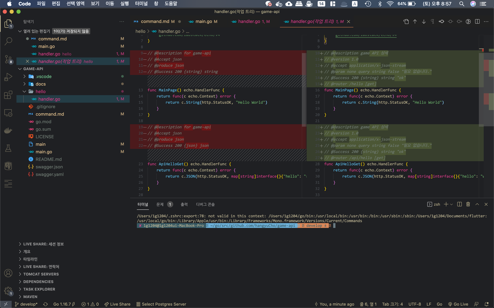

# go
### !!! md 사진 붙여넣기 단축키 cmd + shift + option !!!
## commend 모음
``` go 
go env -w GO111MODULE=auto\n  // 모듈 관련 환경 설정
go build main.go // 실행 전 빌드 명령어
go run main.go // 실행 명령어
go get github.com/hangyuCho/game-api // 레포지토리로부터 소스 다운로드
go mod init github.com/hangyuCho/game-api // 모듈 등록
go mod tidy // 모듈 등록2
```

## bugfix
1. swagger의 명령어를 못찾는 문제
``` shell
# 실행 결과
$ go get github.com/swaggo/swag/cmd/swag
$ go mod tidy
$ swag
zsh: command not found: swag

# 해결법
# GOROOT의 위치에서 명령어를 실행 해줘야함..ㅜ
~/go/bin/swag init
```

2. bad.go:2:43: expected 'package', found 'EOF' 에러 발생

``` shell
# 실행 결과
$ pwd
~/go/bin/swag
$ ~/go/bin/swag init
$ 블라블라블라블라............bad.go:2:43: expected 'package', found 'EOF'

# 해결법
$ pwd
/Users/1g1204/go/src/github.com/hangyuCho/game-api/hello
$ ~/go/bin/swag init
2021/08/13 00:27:06 Generate swagger docs....
2021/08/13 00:27:06 Generate general API Info
2021/08/13 00:27:06 create docs.go at  docs/docs.go
```

3. swagger Fetch errorInternal Server Error doc.json 발생
``` shell
# 실행 결과
$ go run main.go # 실행 자체는 문제 없음..
# http://{host}:{port}/swagger/index.html 접속 시 아래 에러 발생
# Fetch errorInternal Server Error doc.json
# Parser error on line 14 end of the stream or a document separator is expected
```

4. swagger api 정보가 swagger.uaml에 등록안됨..
* 해결법.. 이랄까 문제는 코멘트 주석의 문제..


``` go
// 해결법
package main

import (
	_ "github.com/hangyuCho/game-api/docs" // << 도큐먼트 파일 출력 패스를 메인 패키지에 등록 해줘야 함..!
)
``` 

5. 헤로쿠에 배포할 때 아래와 같은 에러가 발생

``` shell
remote: ../codon/tmp/cache/go-path/pkg/mod/golang.org/x/net@v0.0.0-20210805182204-aaa1db679c0d/http2/client_conn_pool.go:305:6: undefined: errors.Is
remote: note: module requires Go 1.17
remote: github.com/labstack/gommon/bytes
remote: github.com/labstack/gommon/random
remote: golang.org/x/time/rate
remote: golang.org/x/net/webdav/internal/xml
remote: golang.org/x/net/webdav
remote: github.com/swaggo/files
remote:  !     Push rejected, failed to compile Go app.
remote: 
remote:  !     Push failed
remote:  !
remote:  ! ## Warning - The same version of this code has already been built: e9cc5ac4a2a8c44ee930c857d529f3bd16be9a8c
remote:  !
remote:  ! We have detected that you have triggered a build from source code with version e9cc5ac4a2a8c44ee930c857d529f3bd16be9a8c
remote:  ! at least twice. One common cause of this behavior is attempting to deploy code from a different branch.
remote:  !
remote:  ! If you are developing on a branch and deploying via git you must run:
remote:  !
remote:  !     git push heroku <branchname>:main
remote:  !
remote:  ! This article goes into details on the behavior:
remote:  !   https://devcenter.heroku.com/articles/duplicate-build-version
remote: 
remote: Verifying deploy...
remote: 
remote: !       Push rejected to game-api-200.
remote: 
To https://git.heroku.com/game-api-200.git
 ! [remote rejected] master -> master (pre-receive hook declined)
# 해결법..
#main.go 패키지 위에 해당 주석 추가 >> //+build

# 문제2
remote: -----> Running: go install -v -tags heroku . 
remote: can't load package: package github.com/hangyuCho/game-api: build constraints exclude all Go files in /tmp/build_62cb59cf
remote:  !     Push rejected, failed to compile Go app.
remote: 
remote:  !     Push failed
remote: Verifying deploy...
remote: 
remote: !       Push rejected to game-api-200.
remote: 
To https://git.heroku.com/game-api-200.git

# 해결법..
#main.go 패키지 위에 해당 주석 추가 >> //+build linux darwin windows

remote: ../codon/tmp/cache/go-path/pkg/mod/github.com/labstack/echo/v4@v4.5.0/middleware/csrf.go:113:30: undefined: http.SameSiteNoneMode
remote: note: module requires Go 1.15
remote: github.com/swaggo/echo-swagger
remote:  !     Push rejected, failed to compile Go app.
remote: 
remote:  !     Push failed
remote: Verifying deploy...
remote: 
remote: !       Push rejected to game-api-200.
remote: 
To https://git.heroku.com/game-api-200.git

# go mod edit -go=1.15
```
 ## 주석 사용 규칙 참고
 https://github.com/swaggo/swag#declarative-comments-format
 
``` shell


# 실행 결과

# 해결법

```
